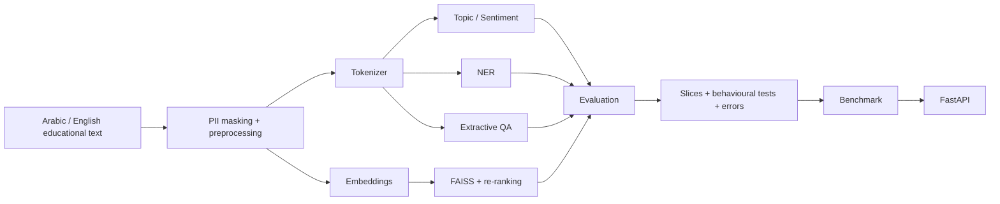

# Bayan — Bilingual Applied NLP Capstone

مشروع تطبيقي ثنائي اللغة في معالجة اللغة الطبيعية، مبني ضمن مسار **Bayan** ويغطي مختبرات الأيام الأربعة في Notebook موحّد قابل لإعادة التشغيل.

**Student:** Yousef Al-Mutiri  
**Repository:** `Yousef0197/sda_nlp-bayan-capstone`  
**Canonical notebook:** `notebooks/bayan_capstone.ipynb`  
**Status:** Day 1–Day 4 implementation complete; final submission validation/release pending.

> **Training context / سياق التدريب:** Bayan — **#SDAIA**  
> هذا مستودع طالب لأغراض تعليمية، وذكر #SDAIA لا يعني اعتمادًا أو تأييدًا رسميًا للمشروع أو نتائجه.

---

## Executive summary | الملخص

يبني مشروع **Bayan** خط معالجة ثنائي اللغة للعربية والإنجليزية يشمل:

- حماية البيانات ومعالجة النصوص.
- Tokenization وTransformer literacy.
- تصنيف الموضوع والمشاعر.
- NER.
- Extractive QA.
- بحثًا دلاليًا باستخدام FAISS.
- تقييمًا سلوكيًا وشرائح وثقة.
- تحليل أخطاء.
- Benchmark وخدمة FastAPI.
- امتدادًا مقاسًا قبل/بعد.

جميع بيانات التطوير والتقييم داخل الـNotebook **تعليمية اصطناعية** وليست بيانات مستفيدين حقيقية أو بيانات حكومية حساسة.

---

## Canonical clean run | التشغيل المرجعي

الدفتر الرئيسي:

`notebooks/bayan_capstone.ipynb`

تم تشغيله من البداية إلى النهاية في Google Colab على T4 دون أخطاء، وانتهى بالعلامة:

`BAYAN_DAY1_DAY4_OFFICIAL_THRESHOLDS=PASS`

مع:

- `MEASURED_SMOKE=True`
- `TEST_USED_FOR_SELECTION=False`
- `ACADEMY_FROZEN_EVAL_REPLACED=False`

هذه القياسات تثبت تشغيل الحزم التعليمية الموجودة في الدفتر، لكنها **لا تُقدَّم بوصفها بديلًا عن أي Frozen Evaluation أو بيئة Benchmark رسمية تعلنها الأكاديمية**.

---

## Measured results | النتائج المقاسة

| Requirement | Measured result in canonical notebook | Notebook check |
|---|---:|---|
| T3 Topic improvement vs baseline | `+0.858` Macro-F1 | PASS |
| T3 Sentiment improvement vs baseline | `+0.663` Macro-F1 | PASS |
| T4 NER entity-level F1 | `1.000` | PASS |
| T5 QA no-answer | `20/20` | PASS |
| T7 Recall@10 | `1.000` | PASS |
| T7 MRR@10 | `1.000` | PASS |
| T8 Invariance | `1.000` | PASS |
| T8 MFT | `1.000` | PASS |
| T9 review table | `100` generated review cases + 3 fixes | REVIEW READY |
| T10 HTTP p99 | `32.907 ms` at concurrency 16 in Colab ASGI path | MEASURED |
| T11 FastAPI | `/health`, `/v1/classify`, ar/en, invalid input, PII canary | PASS |
| T12 measured extension | `+0.88` Top-1 delta | KEEP |

### Important benchmark boundary

قياس HTTP أعلاه تم داخل Colab عبر FastAPI + ASGI transport. إذا كان التقييم الرسمي يشترط **lab CPU** تحديدًا، فيجب إعادة T10 على تلك البيئة قبل الادعاء بأن حد CPU الرسمي تحقق.

---

## Day 1 — Text processing & transformers

يشمل:

- Unicode inspection.
- PII masking.
- معالجة عربية موحّدة.
- token fertility.
- truncation.
- contextual embeddings.
- scaled dot-product attention.
- padding-mask semantics.

---

## Day 2 — Applied NLP tasks

### Topic & sentiment

- TF-IDF baseline.
- Transformer training path.
- مقارنة Macro-F1 قابلة للقياس.

### NER

- `word_ids()`.
- `-100` للـspecial tokens والـcontinuation subwords.
- optimizer step.
- entity-level precision/recall/F1.

### Extractive QA

- start/end position preparation.
- valid-span constraints.
- no-answer handling.
- اختبار 20 حالة no-answer.

---

## Day 3 — Search & evaluation

- unified train/eval/serve Arabic profile.
- Arabic canaries.
- FAISS manifest.
- retrieve + rerank.
- Recall@10 / MRR@10.
- Arabic/English slices.
- bootstrap confidence intervals.
- Invariance.
- MFT.
- 100-case error-review table.
- 3 prioritized fixes.

**T9 boundary:** الجدول مُجهّز للمراجعة، لكن التصنيف الآلي لا يُسمّى مراجعة بشرية. إذا كان الشرط الرسمي يتطلب قراءة وتصنيفًا يدويًا للأخطاء، يجب توثيق اعتماد المراجعة البشرية قبل الإصدار النهائي.

---

## Day 4 — Serving & measured extension

- benchmark ladder.
- parity check.
- FastAPI service.
- `/health`.
- `/v1/classify`.
- Arabic/English requests.
- invalid-input handling.
- startup/API canaries.
- concurrency 16 benchmark.
- measured bilingual retrieval extension.

### Extension decision

تم قياس bilingual concept canonicalization + reranking قبل/بعد.

النتيجة:

`Top-1 delta = +0.88`

القرار:

`KEEP`

---

## Architecture | المعمارية

---

## Privacy & responsible use

- لا تُستخدم بيانات شخصية حقيقية.
- أمثلة الهاتف والبريد مصطنعة لاختبار masking.
- لا توجد مفاتيح API في المستودع.
- لا تُرفع `.env`.
- لا تُرفع model weights أو checkpoints أو caches.
- لا يُعد المشروع نظامًا إنتاجيًا لاتخاذ قرارات عالية الأثر.
- النتائج المقاسة على البيانات الاصطناعية لا تعني جودة مماثلة على بيانات واقعية غير مرئية.

---

## Reproducibility

تشغيل الدفتر:

1. افتح `notebooks/bayan_capstone.ipynb` في Colab.
2. اختر T4 GPU إذا كان متاحًا.
3. استخدم `Runtime → Restart session and run all`.
4. راقب العلامة النهائية.
5. لا تستخدم Test لاختيار seed/threshold/model.

---

## Repository documentation

- `README.md`
- `DATA_CARD.md`
- `MODEL_CARD.md`
- `EVALUATION_REPORT.md`
- `BENCHMARKS.md`
- `DECISIONS.md`
- `PROGRESS.md`
- `PROJECT_SUMMARY.json`
- `SUBMISSION.yml`
- `notebooks/bayan_capstone.ipynb`

---

## Remaining before final release

- اعتماد/توثيق T9 يدويًا إذا كان مطلوبًا حرفيًا.
- إعادة T10 على lab CPU إذا كانت بيئة CPU الرسمية إلزامية.
- تشغيل submission validator.
- التحقق من المستودع في نافذة خاصة.
- إنشاء العرض النهائي.
- إنشاء tag النهائي فقط بعد اكتمال التحقق:

`submission-v1.0`

---

## Acknowledgement & tags

Developed as an educational capstone in the Bayan learning context.

**#SDAIA #Bayan #NLP #ArabicNLP #AppliedNLP**
