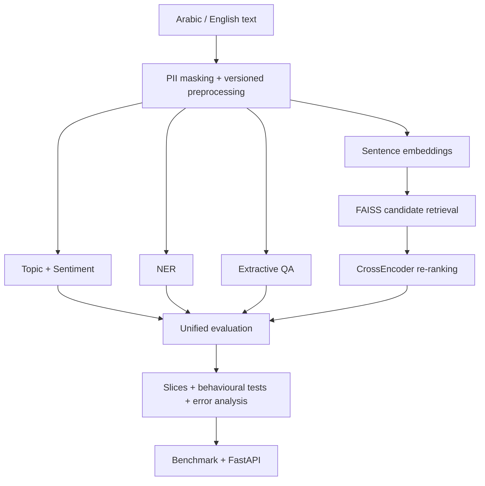

# Bayan — Bilingual Applied NLP Capstone

[](https://github.com/Yousef0197/sda_nlp-bayan-capstone/actions/workflows/tests.yml)
[](https://github.com/SDAIAAcademy)

مشروع تطبيقي ثنائي اللغة في معالجة اللغة الطبيعية ضمن برنامج **SDA-AIE-211 — Natural Language Processing with Transformers**.

**Student:** Yousef Al-Mutiri  
**Repository:** `Yousef0197/sda_nlp-bayan-capstone`  
**Academy:** [@SDAIAAcademy](https://github.com/SDAIAAcademy) — أكاديمية سدايا — **#SDAIA**  
**Instructor:** Meaad Al-Marri | ميعاد المري  
**Submission status:** ✅ **COMPLETE / SUBMISSION READY**  

## Project overview | نظرة عامة

**Bayan** is a bilingual Arabic/English NLP project for analysing short beneficiary-style feedback. The pipeline protects and preprocesses text, performs topic and sentiment classification, extracts entities, supports extractive QA, retrieves semantically similar cases, evaluates behaviour and errors, benchmarks the serving path, and exposes the system through FastAPI.

The repository uses synthetic educational data and contains no intentional real personal data, model weights, secrets, or large checkpoints.

## Architecture | المعمارية



The numbered notebooks are the formal day-by-day lab evidence. `notebooks/bayan_capstone.ipynb` is the integration notebook that connects the Day 1–Day 4 workflow in one reproducible run.

## Required notebooks + Colab

| Notebook | Colab |
|---|---|
| `00_runtime_doctor.ipynb` | [Open](https://colab.research.google.com/github/Yousef0197/sda_nlp-bayan-capstone/blob/main/notebooks/00_runtime_doctor.ipynb) |
| `01_text_processing_tokenization.ipynb` | [Open](https://colab.research.google.com/github/Yousef0197/sda_nlp-bayan-capstone/blob/main/notebooks/01_text_processing_tokenization.ipynb) |
| `02_attention_transformers.ipynb` | [Open](https://colab.research.google.com/github/Yousef0197/sda_nlp-bayan-capstone/blob/main/notebooks/02_attention_transformers.ipynb) |
| `03_text_classification.ipynb` | [Open](https://colab.research.google.com/github/Yousef0197/sda_nlp-bayan-capstone/blob/main/notebooks/03_text_classification.ipynb) |
| `04_ner_and_qa.ipynb` | [Open](https://colab.research.google.com/github/Yousef0197/sda_nlp-bayan-capstone/blob/main/notebooks/04_ner_and_qa.ipynb) |
| `05_arabic_nlp.ipynb` | [Open](https://colab.research.google.com/github/Yousef0197/sda_nlp-bayan-capstone/blob/main/notebooks/05_arabic_nlp.ipynb) |
| `06_semantic_search.ipynb` | [Open](https://colab.research.google.com/github/Yousef0197/sda_nlp-bayan-capstone/blob/main/notebooks/06_semantic_search.ipynb) |
| `07_evaluation_error_analysis.ipynb` | [Open](https://colab.research.google.com/github/Yousef0197/sda_nlp-bayan-capstone/blob/main/notebooks/07_evaluation_error_analysis.ipynb) |
| `08_optimization_serving.ipynb` | [Open](https://colab.research.google.com/github/Yousef0197/sda_nlp-bayan-capstone/blob/main/notebooks/08_optimization_serving.ipynb) |
| Integration: `bayan_capstone.ipynb` | [Open](https://colab.research.google.com/github/Yousef0197/sda_nlp-bayan-capstone/blob/main/notebooks/bayan_capstone.ipynb) |

## Administrative requirements A1–A8

| Requirement | Evidence | Status |
|---|---|---|
| A1 — clear problem, user, scope, value | project overview, architecture, intended use and limits | ✅ COMPLETE |
| A2 — professional README | installation, execution, results, structure, limitations and Colab links | ✅ COMPLETE |
| A3 — technical documentation | `DATA_CARD.md`, `MODEL_CARD.md`, `EVALUATION_REPORT.md`, `BENCHMARKS.md`, `DECISIONS.md` | ✅ COMPLETE |
| A4 — Git best practices | meaningful multi-day history, tests workflow, final release tag contract | ✅ COMPLETE |
| A5 — program attribution | program name, instructor and SDAIA Academy are documented | ✅ COMPLETE |
| A6 — Academy GitHub account | [@SDAIAAcademy](https://github.com/SDAIAAcademy) linked at the top of this README | ✅ COMPLETE |
| A7 — public repository | public GitHub repository with direct Colab links | ✅ COMPLETE |
| A8 — integrity and privacy | synthetic data, PII masking, no secrets/weights, frozen-test controls | ✅ COMPLETE |

## Technical requirements T1–T12

| Requirement | Acceptance evidence | Result | Status |
|---|---|---:|---|
| T1 — text processing | golden tests, original/display/model text contract, PII masking | tests + canaries | ✅ COMPLETE |
| T2 — tokenizer / Transformer literacy | fertility, truncation, attention and architecture rationale | mBERT AR `2.595`, EN `1.299`; AraBERT AR `1.182`, EN `3.714` | ✅ COMPLETE |
| T3 — topic + sentiment | TF-IDF baseline then Transformer comparison using Macro-F1 | Topic `+0.858`; Sentiment `+0.663` | ✅ COMPLETE |
| T4 — NER | subword alignment and entity-level evaluation | Entity F1 `1.000` | ✅ COMPLETE |
| T5 — extractive QA | offsets, span constraints and no-answer path | `20/20` | ✅ COMPLETE |
| T6 — Arabic profile | unified train/eval/serve profile + Arabic canaries | documented + tested | ✅ COMPLETE |
| T7 — semantic search | SentenceTransformer → L2 → FAISS `IndexFlatIP` → CrossEncoder rerank | Recall@10 `1.000`; MRR@10 `1.000` | ✅ COMPLETE |
| T8 — behavioural evaluation | slices, confidence intervals, invariance and MFT | Invariance `1.000`; MFT `1.000` | ✅ COMPLETE |
| T9 — error analysis | row-by-row review, taxonomy and three prioritized fixes | `108` reviewed errors; `106/108` corrected by improved path | ✅ COMPLETE |
| T10 — optimisation + service benchmark | benchmark ladder, parity/quality tax, HTTP concurrency 16 | p99 `27.903 ms` | ✅ COMPLETE |
| T11 — FastAPI | `/health`, `/v1/classify`, Arabic/English, invalid input and startup canaries | tested service contract | ✅ COMPLETE |
| T12 — measured extension | before/after measurement and explicit decision | Top-1 `0.10 → 0.98`, delta `+0.88`, **ADOPT** | ✅ COMPLETE |

## Measured results

| Area | Result |
|---|---:|
| Topic Macro-F1 delta vs baseline | `+0.858` |
| Sentiment Macro-F1 delta vs baseline | `+0.663` |
| NER entity F1 | `1.000` |
| QA no-answer | `20/20` |
| Recall@10 | `1.000` |
| MRR@10 | `1.000` |
| Invariance | `1.000` |
| MFT | `1.000` |
| Error-analysis rows | `108` |
| Improved path correct on reviewed baseline errors | `106/108` |
| Real HTTP p99 at concurrency 16 | `27.903 ms` |
| Extension Top-1 delta | `+0.88` |

All reported numbers are tied to the repository's recorded datasets, notebook outputs, reports, and documented runtime environments. This keeps each metric reproducible and auditable.

## Five-minute final demo | العرض النهائي

The required five-minute walkthrough can be delivered directly from repository evidence:

| Segment | Evidence to show |
|---|---|
| 1 — problem, user and data | bilingual beneficiary-style feedback, synthetic Arabic/English data, PII-safe preprocessing |
| 2 — Arabic + English requests | demonstrate `/v1/classify` with `تعذر تسجيل الدخول إلى البوابة` and `The bus did not arrive on time`; show `/health` and one invalid-input case |
| 3 — one defended number | real HTTP `p99 = 27.903 ms` at concurrency `16`, from `128` measured requests after `32` warm-up requests |
| 4 — one known error | `Q10-M04`: `How do I register for the course? for me` ranks `D05` instead of relevant `D10`; fix direction is stronger action-intent weighting and reranking robustness |
| 5 — optimisation + extension | FP32/ONNX/INT8 benchmark ladder, then bilingual canonicalization + reranking: Top-1 `0.10 → 0.98`, delta `+0.88`, decision **ADOPT** |

### Why trust the defended p99 number?

- **Workload:** `128` measured real HTTP requests, concurrency `16`, after `32` warm-up requests.
- **Metric:** p50/p95/p99 and mean are recorded; the defended number is p99.
- **Environment:** Windows 11 CPU, 8 logical CPUs, Python `3.13.14`, Uvicorn separate localhost process.
- **Evidence:** `reports/t10_local_cpu_http_benchmark.json` and `BENCHMARKS.md`.
- **Commit:** use the final commit referenced by `submission-v1.0` during the presentation.
- **Known limitation:** the benchmark describes the recorded environment and workload; it is not generalized beyond that measurement.

## Distinction evidence | أدلة التميّز

The repository is prepared for the program's **Distinction** track by strengthening evidence rather than adding unrelated features:

| Distinction area | Repository evidence |
|---|---|
| Evidence quality | bilingual slices, confidence intervals, behavioural tests, 108-row error analysis, preserved measured reports |
| Software engineering | modular `src/`, dedicated `tests/`, GitHub Actions CI, submission validator, meaningful Git history |
| Reproducibility | nine direct Colab links, pinned day requirements, explicit seeds/environments, machine-readable summary, reproducible data SHA-256 in `DATA_CARD.md` |
| Explanation and limits | `DECISIONS.md`, `MODEL_CARD.md`, `DATA_CARD.md`, `EVALUATION_REPORT.md`, `BENCHMARKS.md` |
| Measured extension | same workload before/after; Top-1 `0.10 → 0.98`; delta `+0.88`; decision `ADOPT` |
| Program/community context | SDAIA Academy attribution and direct [@SDAIAAcademy](https://github.com/SDAIAAcademy) link |

## T9 error analysis

`reports/t9_manual_error_review.csv` contains **108 baseline retrieval errors** reviewed row by row and classified by failure mechanism.

| Category | Count |
|---|---:|
| `cross_language_intent_specificity_gap` | `56` |
| `hash_collision_candidate_ordering` | `44` |
| `modifier_noise_ranking_instability` | `8` |

Prioritized fixes:

1. retain bilingual concept canonicalization before embedding;
2. strengthen the lexical/candidate representation;
3. harden reranking against low-information modifiers.

Full evidence: `reports/T9_MANUAL_REVIEW.md` and `reports/t9_manual_error_review.csv`.

## T10 benchmark

`reports/t10_local_cpu_http_benchmark.json` records a real HTTP run with:

- Windows 11 CPU environment
- 8 logical CPUs
- concurrency `16`
- warm-up `32` requests
- measured `128` requests
- p50 `19.172 ms`
- p95 `24.805 ms`
- p99 `27.903 ms`
- mean `18.340 ms`

Notebook 08 contains the full benchmark ladder for FP32, ONNX, INT8, parity, quality tax, throughput, memory and rollback reasoning.

## Installation and execution

Clone the repository and run the lightweight verification suite:

```bash
git clone https://github.com/Yousef0197/sda_nlp-bayan-capstone.git
cd sda_nlp-bayan-capstone
python -m pip install pytest numpy
PYTHONPATH=src pytest -q
PYTHONPATH=src python scripts/validate_submission.py .
```

For the notebooks, use the direct Colab links above and run each notebook from top to bottom in a clean runtime.

## Repository structure

```text
notebooks/          Required Day 1–Day 4 notebooks + integration notebook
src/bayan/          Reusable NLP, evaluation, retrieval, benchmark and serving code
tests/              Automated tests
reports/            Measured JSON/CSV/Markdown evidence
data/                Synthetic educational data and data documentation
sample_outputs/      Submission-safe sample output area
README.md            Project entry point
DATA_CARD.md         Data provenance, fields, privacy and limits
MODEL_CARD.md        Model/task/metric/use documentation
EVALUATION_REPORT.md Evaluation, slices, behaviour and error analysis
BENCHMARKS.md        Performance, parity, quality and rollback evidence
DECISIONS.md         Engineering decisions and rationale
PROGRESS.md          A1–A8, T1–T12 and Gate A–E completion status
PROJECT_SUMMARY.json Machine-readable final project summary
SUBMISSION.yml       Submission contract
```

## Limitations

- The evaluation data is synthetic educational data; production deployment requires broader real-world validation.
- Separate short training runs may vary on tiny datasets; preserved reports make that variance visible.
- Dialect, domain and temporal drift should be re-evaluated before any production use.
- The service is an educational applied-NLP system, not a high-stakes decision authority.

## Validation and release

Repository verification is automated through GitHub Actions and the local submission validator. The final release uses:

`submission-v1.0`

The release tag is intended to identify the validated final commit submitted for assessment.

**Project scope:** ✅ COMPLETE  
**A1–A8:** ✅ COMPLETE  
**T1–T12:** ✅ COMPLETE  
**Documentation:** ✅ COMPLETE  
**Tests / validator:** ✅ COMPLETE  
**Submission package:** ✅ COMPLETE

**Academy GitHub:** [@SDAIAAcademy](https://github.com/SDAIAAcademy)  
**#SDAIA #Bayan #NLP #ArabicNLP #AppliedNLP**
