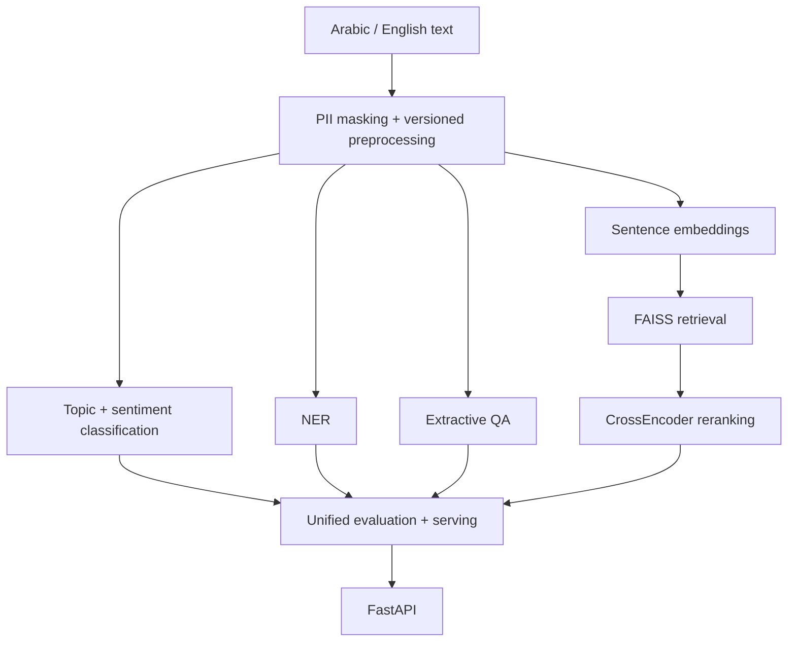

# Bayan — Bilingual Applied NLP Capstone

[](https://github.com/Yousef0197/sda_nlp-bayan-capstone/actions/workflows/tests.yml)
[](https://github.com/SDAIAAcademy)

مشروع تطبيقي ثنائي اللغة في معالجة اللغة الطبيعية ضمن برنامج **SDA-AIE-211 — Natural Language Processing with Transformers**.

**Student:** Yousef Al-Mutiri  
**Repository:** `Yousef0197/sda_nlp-bayan-capstone`  
**Academy:** [@SDAIAAcademy](https://github.com/SDAIAAcademy) — أكاديمية سدايا — **#SDAIA**  
**Instructor:** Meaad Al-Marri | ميعاد المري  
**Submission status:** ✅ **COMPLETE / SUBMISSION READY**  

## Project overview | نظرة عامة

**Bayan** is a bilingual Arabic/English NLP project for analysing short beneficiary-style feedback. The pipeline protects and preprocesses text, performs topic and sentiment classification, extracts entities, supports extractive QA, retrieves semantically similar cases, evaluates behaviour and errors, benchmarks the serving path, and exposes the system through FastAPI.

The repository uses synthetic educational data and contains no intentional real personal data, model weights, secrets, or large checkpoints.

## Architecture | المعمارية



## Core results | النتائج الأساسية

| Area | Measured result |
|---|---:|
| Topic classification improvement vs TF-IDF | `+0.858 Macro-F1` |
| Sentiment classification improvement vs TF-IDF | `+0.663 Macro-F1` |
| NER entity F1 | `1.000` |
| QA no-answer | `20/20` |
| Semantic search Recall@10 | `1.000` |
| Semantic search MRR@10 | `1.000` |
| Behavioural invariance | `1.000` |
| Minimum Functionality Tests | `1.000` |
| T9 baseline errors reviewed | `108` |
| T9 improved correct on reviewed errors | `106/108` |
| Measured extension Top-1 | `0.10 → 0.98` |
| Real HTTP p99, concurrency 16 | `27.903 ms` |

Detailed evidence is linked from `EVALUATION_REPORT.md`, `BENCHMARKS.md`, `PROGRESS.md`, `MODEL_CARD.md`, and `PROJECT_SUMMARY.json`.

## Project structure | هيكل المشروع

```text
.
├── notebooks/                    # 9 required Colab notebooks + integration notebook
├── src/bayan/                    # reusable project modules
├── tests/                        # automated unit/contract tests
├── data/sample/                  # synthetic educational fixtures
├── reports/                      # measured reports and manual review evidence
├── sample_outputs/               # small submission-safe API examples
├── README.md
├── STUDENT_PROFILE.md
├── PROGRESS.md
├── DECISIONS.md
├── BENCHMARKS.md
├── EVALUATION_REPORT.md
├── MODEL_CARD.md
├── DATA_CARD.md
├── PROJECT_SUMMARY.json
└── SUBMISSION.yml
```

## Notebooks | الدفاتر

| # | Notebook | Colab |
|---:|---|---|
| 00 | Runtime Doctor | [Open in Colab](https://colab.research.google.com/github/Yousef0197/sda_nlp-bayan-capstone/blob/main/notebooks/00_runtime_doctor.ipynb) |
| 01 | Text Processing & Tokenisation | [Open in Colab](https://colab.research.google.com/github/Yousef0197/sda_nlp-bayan-capstone/blob/main/notebooks/01_text_processing_tokenization.ipynb) |
| 02 | Attention & Transformers | [Open in Colab](https://colab.research.google.com/github/Yousef0197/sda_nlp-bayan-capstone/blob/main/notebooks/02_attention_transformers.ipynb) |
| 03 | Text Classification | [Open in Colab](https://colab.research.google.com/github/Yousef0197/sda_nlp-bayan-capstone/blob/main/notebooks/03_text_classification.ipynb) |
| 04 | NER & QA | [Open in Colab](https://colab.research.google.com/github/Yousef0197/sda_nlp-bayan-capstone/blob/main/notebooks/04_ner_and_qa.ipynb) |
| 05 | Arabic NLP | [Open in Colab](https://colab.research.google.com/github/Yousef0197/sda_nlp-bayan-capstone/blob/main/notebooks/05_arabic_nlp.ipynb) |
| 06 | Semantic Search | [Open in Colab](https://colab.research.google.com/github/Yousef0197/sda_nlp-bayan-capstone/blob/main/notebooks/06_semantic_search.ipynb) |
| 07 | Evaluation & Error Analysis | [Open in Colab](https://colab.research.google.com/github/Yousef0197/sda_nlp-bayan-capstone/blob/main/notebooks/07_evaluation_error_analysis.ipynb) |
| 08 | Optimisation & Serving | [Open in Colab](https://colab.research.google.com/github/Yousef0197/sda_nlp-bayan-capstone/blob/main/notebooks/08_optimization_serving.ipynb) |
| — | Full integration capstone | [Open in Colab](https://colab.research.google.com/github/Yousef0197/sda_nlp-bayan-capstone/blob/main/notebooks/bayan_capstone.ipynb) |

## Quick verification | تحقق سريع

```bash
PYTHONPATH=src pytest -q
PYTHONPATH=src python scripts/validate_submission.py .
```

Final release verification:

```bash
PYTHONPATH=src python scripts/validate_submission.py . --require-tag
```

## Reproducibility | إعادة التشغيل

The repository includes pinned day-specific requirements, synthetic sample data, reusable modules, unit tests, GitHub Actions CI, machine-readable project metadata, and direct Colab links.

The project deliberately does not track model weights or large ONNX/checkpoint artefacts. Small measured JSON/CSV reports are preserved instead.

## Data and privacy | البيانات والخصوصية

- synthetic educational data only;
- no intentional real citizen/customer data;
- PII masking before model-facing processing;
- synthetic phone/email canaries for privacy tests;
- no `.env`, API keys, secrets, model weights, or large checkpoints committed.

See `DATA_CARD.md` and `MODEL_CARD.md` for details.

## Known limitations | الحدود

- The datasets are small and synthetic.
- Results are educational measurements, not production guarantees.
- Real deployment requires broader governed data, privacy review, drift monitoring and production reliability controls.
- Some measured task results are intentionally tied to the exact fixtures and runtime documented in the corresponding report.

## Submission evidence | أدلة التسليم

- `PROGRESS.md` — Gates A–E and A1–A8/T1–T12 status.
- `DECISIONS.md` — engineering decisions and trade-offs.
- `BENCHMARKS.md` — optimisation and service measurements.
- `EVALUATION_REPORT.md` — metrics, slices, behavioural tests and errors.
- `MODEL_CARD.md` — model/task documentation and limits.
- `DATA_CARD.md` — dataset provenance, schemas, privacy and hashes.
- `PROJECT_SUMMARY.json` — machine-readable final summary.
- `SUBMISSION.yml` — submission contract.
- `reports/T9_MANUAL_REVIEW.md` — 108-row manual error review evidence.
- `reports/t10_local_cpu_http_benchmark.json` — preserved real HTTP latency measurement.
- `reports/t10_project_artifact_benchmark.json` — measured Gate D project-artifact optimisation evidence.
- `reports/submission_validation.json` — preserved validator result.

## Final status

**Implementation:** ✅ COMPLETE  
**Automated tests:** ✅ PASS  
**Submission validator:** ✅ PASS  
**Gate D project artifact:** ✅ PASS  
**A1–A8:** ✅ COMPLETE  
**T1–T12:** ✅ COMPLETE  
**Documentation:** ✅ COMPLETE  
**Submission package:** ✅ COMPLETE

**Academy GitHub:** [@SDAIAAcademy](https://github.com/SDAIAAcademy)  
**#SDAIA #Bayan #NLP #ArabicNLP #AppliedNLP**
