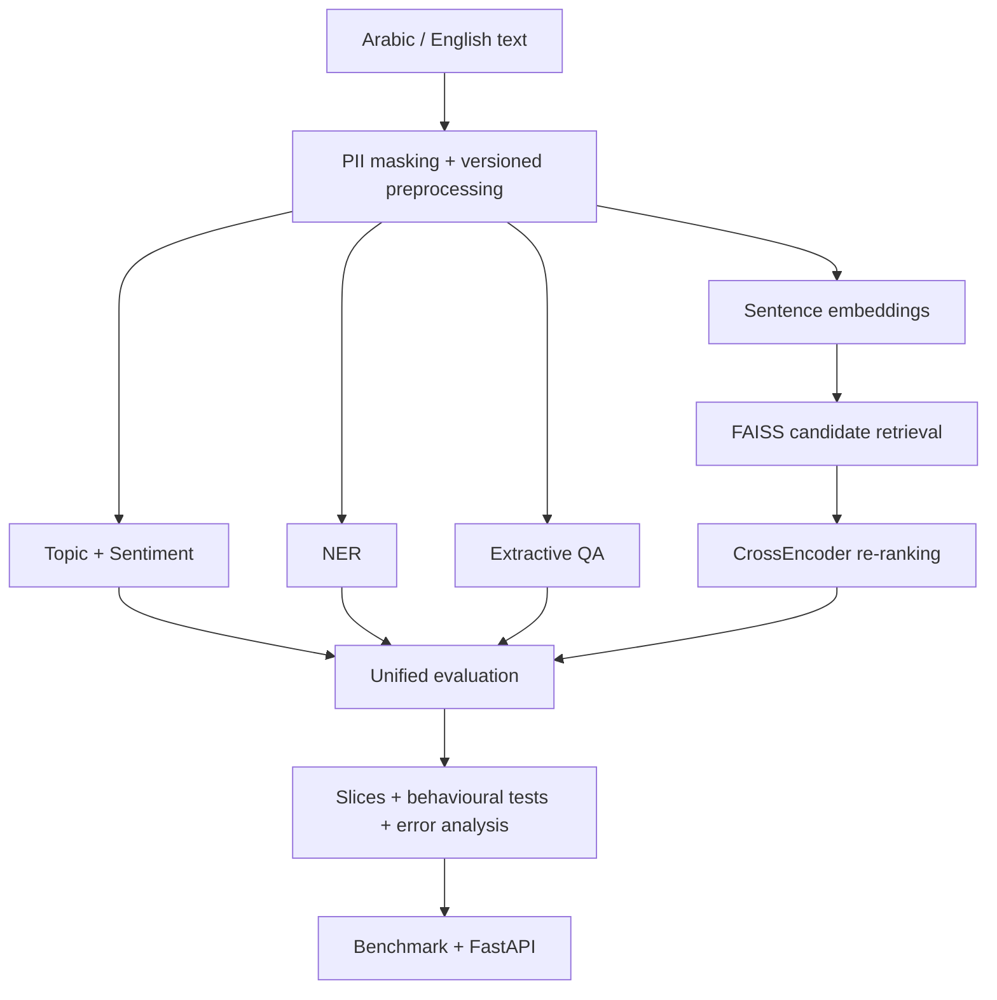

# Bayan — Bilingual Applied NLP Capstone

[](https://github.com/Yousef0197/sda_nlp-bayan-capstone/actions/workflows/tests.yml)

مشروع تطبيقي ثنائي اللغة في معالجة اللغة الطبيعية ضمن برنامج **SDA-AIE-211 — Natural Language Processing with Transformers**.

**Student:** Yousef Al-Mutiri  
**Repository:** `Yousef0197/sda_nlp-bayan-capstone`  
**Academy:** أكاديمية سدايا — **#SDAIA**  
**Instructor:** Meaad Al-Marri | ميعاد المري

## Evidence status

**Implementation:** COMPLETE  
**Repository evidence:** COMPLETE / scoped honestly  
**Academy frozen evaluation:** NOT REPLACED  
**Reference lab hardware:** NOT CLAIMED  
**Release:** refresh `submission-v1.0` only after the latest `main` passes validation.

> نتائج الدفاتر التعليمية الصغيرة هي `MEASURED_SMOKE`. هي تثبت أن مسارات المشروع تعمل وتسمح بتدقيق المنهج والكود، لكنها لا تُقدَّم على أنها بديل لحزمة تقييم مجمدة أو جهاز مختبر مرجعي تعلنه الأكاديمية.

---

## Architecture | المعمارية



The numbered course notebooks are the full lab evidence. `notebooks/bayan_capstone.ipynb` is an additional integration notebook used for a clean Day 1–Day 4 smoke run; it does not replace the fuller numbered notebooks.

In particular, `notebooks/06_semantic_search.ipynb` contains the required sentence-embedding → FAISS → **CrossEncoder** re-ranking path. The integration notebook uses a lighter deterministic bilingual canonicalization/reranking path for its reproducible smoke suite.

---

## Required notebooks + Colab

| Notebook | Colab |
|---|---|
| `00_runtime_doctor.ipynb` | [Open](https://colab.research.google.com/github/Yousef0197/sda_nlp-bayan-capstone/blob/main/notebooks/00_runtime_doctor.ipynb) |
| `01_text_processing_tokenization.ipynb` | [Open](https://colab.research.google.com/github/Yousef0197/sda_nlp-bayan-capstone/blob/main/notebooks/01_text_processing_tokenization.ipynb) |
| `02_attention_transformers.ipynb` | [Open](https://colab.research.google.com/github/Yousef0197/sda_nlp-bayan-capstone/blob/main/notebooks/02_attention_transformers.ipynb) |
| `03_text_classification.ipynb` | [Open](https://colab.research.google.com/github/Yousef0197/sda_nlp-bayan-capstone/blob/main/notebooks/03_text_classification.ipynb) |
| `04_ner_and_qa.ipynb` | [Open](https://colab.research.google.com/github/Yousef0197/sda_nlp-bayan-capstone/blob/main/notebooks/04_ner_and_qa.ipynb) |
| `05_arabic_nlp.ipynb` | [Open](https://colab.research.google.com/github/Yousef0197/sda_nlp-bayan-capstone/blob/main/notebooks/05_arabic_nlp.ipynb) |
| `06_semantic_search.ipynb` | [Open](https://colab.research.google.com/github/Yousef0197/sda_nlp-bayan-capstone/blob/main/notebooks/06_semantic_search.ipynb) |
| `07_evaluation_error_analysis.ipynb` | [Open](https://colab.research.google.com/github/Yousef0197/sda_nlp-bayan-capstone/blob/main/notebooks/07_evaluation_error_analysis.ipynb) |
| `08_optimization_serving.ipynb` | [Open](https://colab.research.google.com/github/Yousef0197/sda_nlp-bayan-capstone/blob/main/notebooks/08_optimization_serving.ipynb) |
| Integration notebook `bayan_capstone.ipynb` | [Open](https://colab.research.google.com/github/Yousef0197/sda_nlp-bayan-capstone/blob/main/notebooks/bayan_capstone.ipynb) |

---

## Program requirements R1–R7

| Requirement | Repository evidence | Current interpretation |
|---|---|---|
| R1 — preprocessing/privacy | versioned preprocessing modules, PII masking, train/eval/serve contract, canaries and tests | implementation/evidence ready; official batch canaries depend on academy package |
| R2 — models | TF-IDF baseline, multilingual Transformer path, entity-level NER, extractive QA/no-answer | smoke metrics recorded; no claim that smoke replaces frozen evaluation |
| R3 — search | multilingual SentenceTransformer, L2 + FAISS `IndexFlatIP`, CrossEncoder reranking in Notebook 06, Recall/MRR and cross-lingual analysis | full lab path present; smoke metrics recorded |
| R4 — evaluation | language slices, bootstrap CI, invariance/MFT, 108 row-by-row reviewed baseline errors, top-3 fixes | AI-assisted semantic review complete; `T9_HUMAN_REVIEW_CLAIM=FALSE` |
| R5 — serving/performance | Notebook 08 benchmark ladder, FP32/ONNX/INT8/rollback path, FastAPI, local real-HTTP benchmark at concurrency 16 | local CPU evidence recorded; academy lab CPU is not claimed |
| R6 — architectural literacy | tokenizer fertility/truncation evidence, checkpoint rationale, attention limits, slice evidence, decisions | documented in `DECISIONS.md` and Day 1 report |
| R7 — hygiene/extension | frozen-test boundary, reproducibility, validator, no weights/secrets, measured extension | repository evidence complete; final tag must be refreshed after final validation |

---

## Measured evidence

### Integration smoke suite

The integration notebook recorded:

| Area | Result | Evidence class |
|---|---:|---|
| Topic delta vs baseline | `+0.858` Macro-F1 | `MEASURED_SMOKE` |
| Sentiment delta vs baseline | `+0.663` Macro-F1 | `MEASURED_SMOKE` |
| NER entity F1 | `1.000` | `MEASURED_SMOKE` |
| QA no-answer | `20/20` | `MEASURED_SMOKE` |
| Recall@10 | `1.000` | `MEASURED_SMOKE` |
| MRR@10 | `1.000` | `MEASURED_SMOKE` |
| Invariance | `1.000` | `MEASURED_SMOKE` |
| MFT | `1.000` | `MEASURED_SMOKE` |
| Extension Top-1 delta | `+0.88` | `MEASURED_SMOKE` |

The notebook also records:

`MEASURED_SMOKE=True`  
`TEST_USED_FOR_SELECTION=False`  
`ACADEMY_FROZEN_EVAL_REPLACED=False`

The printed marker `BAYAN_DAY1_DAY4_OFFICIAL_THRESHOLDS=PASS` is interpreted only as “the included smoke suites meet the numeric threshold values”; it is **not** presented as proof that an unavailable academy-frozen package was passed.

### T9 — error analysis

`reports/t9_manual_error_review.csv` contains **108 actual baseline errors** reviewed row by row for semantic relevance and failure mechanism.

- reviewed baseline errors: `108`
- improved system correct on those baseline errors: `106/108`
- residual improved errors: `2`
- reviewer: GPT-5.6 Sol, AI-assisted row-by-row semantic review
- human-review claim: `FALSE`

Full methodology and categories: `reports/T9_MANUAL_REVIEW.md`.

### T10 — real HTTP local CPU

`reports/t10_local_cpu_http_benchmark.json` records:

- Windows 11 local CPU
- 8 logical CPUs
- concurrency: `16`
- warm-up: `32` requests
- measured: `128` requests
- p50: `19.172 ms`
- p95: `24.805 ms`
- p99: `27.903 ms`
- mean: `18.340 ms`

This is valid **local measured evidence**, but it is not labelled as the academy reference lab CPU.

---

## Day 1 architectural evidence

The Day 1 report records tokenizer fertility on a fixed bilingual sample:

| Tokenizer | Arabic fertility | English fertility |
|---|---:|---:|
| mBERT | `2.595` | `1.299` |
| AraBERT | `1.182` | `3.714` |

The bilingual path therefore kept a multilingual tokenizer/checkpoint family rather than optimizing only for Arabic token fertility. Attention documentation also records mask semantics, the quadratic `T × T` attention-score shape, and truncation as an explicit design risk.

See `reports/day1_report.md` and `DECISIONS.md`.

---

## Reproducibility

For the integration notebook:

1. Open `notebooks/bayan_capstone.ipynb` in Colab.
2. Restart the session.
3. Run all cells from top to bottom.
4. Treat outputs according to their evidence labels.
5. Do not use the test split for repeated model/threshold selection.

For the formal lab paths, run the numbered notebooks independently in order and preserve their generated small reports. Large model weights, caches and ONNX artefacts must remain outside GitHub.

Local repository checks:

```bash
PYTHONPATH=src pytest -q
PYTHONPATH=src python scripts/validate_submission.py .
```

After refreshing the final tag:

```bash
PYTHONPATH=src python scripts/validate_submission.py . --require-tag
```

---

## Documentation

- `README.md`
- `STUDENT_PROFILE.md`
- `PROGRESS.md`
- `DECISIONS.md`
- `BENCHMARKS.md`
- `EVALUATION_REPORT.md`
- `MODEL_CARD.md`
- `DATA_CARD.md`
- `PROJECT_SUMMARY.json`
- `SUBMISSION.yml`

---

## Release integrity

`submission-v1.0` already exists, but it was created before the latest evidence-alignment commits. It must be moved/recreated on the final validated `main` commit before submission is considered frozen.

This repository intentionally distinguishes:

- implementation completion,
- measured smoke/local evidence,
- external academy-frozen evaluation,
- and final release/tag integrity.

**#SDAIA #Bayan #NLP #ArabicNLP #AppliedNLP**
