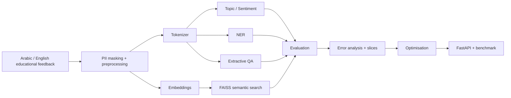

# Bayan — Bilingual Applied NLP Capstone

مشروع تطبيقي ثنائي اللغة في معالجة اللغة الطبيعية، مبني ضمن مسار بيان.

**Student:** Yousef Al-Mutiri
**GitHub:** https://github.com/Yousef0197
**Repository:** https://github.com/Yousef0197/sda_nlp-bayan-capstone
**Current status:** Gate A completed — Gates B–E pending
**Final release:** Not created yet

---

## Executive summary | الملخص

يهدف مشروع **Bayan** إلى بناء مسار تطبيقي موحّد لمعالجة الملاحظات التعليمية بالعربية والإنجليزية باستخدام تقنيات معالجة اللغة الطبيعية.

يشمل النطاق النهائي للمشروع:

- حماية البيانات ومعالجتها.
- تصنيف الموضوع والمشاعر.
- التعرف على الكيانات المسماة.
- الإجابة الاستخراجية عن الأسئلة.
- البحث الدلالي الثنائي اللغة.
- التقييم وتحليل الأخطاء.
- تحسين الأداء وخدمة النموذج عبر API.

يستخدم المشروع بيانات تعليمية اصطناعية أو عامة فقط أثناء التطوير والتقييم.

لا تُستخدم بيانات مستفيدين حقيقية، ولا بيانات حكومية حساسة، ولا أسرار أو مفاتيح وصول داخل المستودع.

---

## Current project status | حالة المشروع

| Gate | Status | Scope |
|---|---|---|
| Gate A — ingest | ✅ PASSED | preprocessing, tokenisation, attention, transformers |
| Gate B — tasks | ⬜ NOT_STARTED | classification, NER, QA |
| Gate C — search & truth | ⬜ NOT_STARTED | semantic search, evaluation, error analysis |
| Gate D — ship | ⬜ NOT_STARTED | optimisation, benchmark, FastAPI |
| Gate E — submit | ⬜ NOT_STARTED | validation, presentation, release |

التفاصيل الكاملة موجودة في:

`PROGRESS.md`

---

## What Bayan does | ماذا يفعل بيان؟

### 1. Privacy and preprocessing

المسار الحالي يدعم:

- الاحتفاظ بنسخة خام مستقلة من النص.
- إنشاء نسخة مهيأة للنموذج.
- Unicode normalization باستخدام `NFC`.
- إزالة الكشيدة.
- توحيد المسافات.
- إخفاء البريد الإلكتروني.
- إخفاء أرقام الهاتف.
- معالجة عربية محافظة لتجنب التطبيع المفرط.

لا تُزال التشكيلات ولا تُوحّد صور الألف افتراضيًا دون دليل مرتبط بالمهمة.

### 2. Topic and sentiment classification

**Status:** Pending — Gate B

سيتم بناء:

- baseline باستخدام TF-IDF.
- نموذج Transformer.
- مقارنة قابلة للقياس بين baseline والنموذج.
- تقييم بالعربية والإنجليزية.

لن تُدرج نتيجة نهائية هنا حتى تنفيذ Gate B وقياسها فعليًا.

### 3. Named Entity Recognition — NER

**Status:** Pending — Gate B

سيشمل المسار:

- محاذاة الكلمات والرموز.
- التعامل مع `word_ids`.
- استخدام `-100` للمواضع غير الداخلة في الخسارة.
- قياس entity-level F1.

### 4. Extractive Question Answering — QA

**Status:** Pending — Gate B

سيشمل:

- تحديد موضع بداية الإجابة ونهايتها.
- استخراج span صالح.
- التعامل مع الأسئلة التي لا تملك إجابة.
- قياس EM وF1 وأداء no-answer.

### 5. Bilingual semantic search

**Status:** Pending — Gate C

سيشمل:

- embeddings.
- FAISS.
- Recall@k.
- MRR.
- تحليل نتائج البحث بالعربية والإنجليزية.

### 6. Evaluation and serving

**Status:** Pending — Gates C and D

سيشمل:

- تقييمًا مجمدًا.
- تحليل الأخطاء.
- اختبارات invariance وMFT.
- Benchmark للأداء.
- FastAPI.
- اختبارات canary.
- دراسة ONNX وINT8 استنادًا إلى قياسات فعلية.

---

## Scope and non-goals | النطاق وما لا يدعيه المشروع

### In scope

- نصوص تعليمية اصطناعية أو عامة.
- العربية والإنجليزية.
- معالجة النصوص والترميز.
- Transformer-based NLP tasks.
- التقييم القابل لإعادة التنفيذ.
- البحث الدلالي.
- خدمة API مختبرة.

### Out of scope

- بيانات شخصية حقيقية.
- بيانات حكومية سرية أو حساسة.
- اتخاذ قرارات رسمية آلية عن الأفراد.
- ادعاء جاهزية إنتاجية قبل اكتمال الاختبارات والتقييم النهائي.

### Responsible-use boundary

Bayan مشروع تعليمي وتطبيقي.

لا ينبغي استخدام مخرجاته لاتخاذ قرارات عالية الأثر دون:

- تحقق إضافي.
- مراجعة بشرية.
- تقييم للبيانات الفعلية.
- مراجعة أمنية وخصوصية مستقلة.

---

## Architecture | المعمارية

المعمارية المستهدفة للمشروع:



---

# Gate A — Day 1 evidence

Gate A يغطّي Lab 1 وLab 2.

## Lab 1 — Text Processing & Tokenisation

الوظائف المنفذة:

- Unicode inspection.
- two-copy preprocessing.
- PII masking.
- spaCy sentence segmentation.
- conservative Arabic profile.
- local WordPiece demonstration.
- mBERT comparison.
- AraBERT comparison.
- token fertility.
- truncation measurement.
- Token IDs to embeddings.
- Arabic clitic test.
- repeated random-seed experiment.

Notebook:

`notebooks/01_text_processing_tokenization.ipynb`

Open in Colab:

https://colab.research.google.com/github/Yousef0197/sda_nlp-bayan-capstone/blob/main/notebooks/01_text_processing_tokenization.ipynb

---

## Notebook 01 reproducibility

تم تشغيل Notebook 01 من جلسة نظيفة وبالترتيب.

بيئة التشغيل المحفوظة:

`Python 3.13.15`

Core marker:

`DAY1_NOTEBOOK1_CORE=PASS`

Distinction markers:

- `DISTINCTION_CLITIC_TEST=PASS`
- `DISTINCTION_THREE_SEEDS=PASS`
- `DISTINCTION_TOKENIZER_COMPARISON=PASS`
- `BILINGUAL_TRUNCATION_MEASUREMENT=PASS`
- `DAY1_DISTINCTION_REPRODUCIBLE=PASS`

---

## Bilingual tokenizer measurements

استُخدمت عينة اصطناعية ثابتة من أربعة نصوص عربية وأربعة نصوص إنجليزية.

### Token fertility

| Tokenizer | Arabic fertility | English fertility |
|---|---:|---:|
| mBERT | `2.595` | `1.299` |
| AraBERT | `1.182` | `3.714` |

AraBERT أكثر اقتصادًا في تجزئة العربية ضمن هذه العينة.

mBERT أظهر توازنًا أفضل بين العربية والإنجليزية عند الحاجة إلى مرمّز واحد للمسار الثنائي اللغة.

هذه النتيجة لا تثبت وحدها تفوق أحد النموذجين في جودة المهام النهائية.

---

## Truncation measurement

| Tokenizer | max_length | Arabic | English | Combined |
|---|---:|---:|---:|---:|
| mBERT | 32 | `0.0%` | `0.0%` | `0.0%` |
| mBERT | 64 | `0.0%` | `0.0%` | `0.0%` |
| AraBERT | 32 | `0.0%` | `0.0%` | `0.0%` |
| AraBERT | 64 | `0.0%` | `0.0%` | `0.0%` |

لم تُظهر العينة الصغيرة الحالية قطعًا عند `32` أو `64`.

سيُعاد القياس عند تجميد مجموعة البيانات النهائية.

---

## Approximate tokenisation time

نتيجة التشغيل النظيف المحفوظ:

| Tokenizer | Mean tokenisation time |
|---|---:|
| mBERT | `0.1421 ms` |
| AraBERT | `0.1631 ms` |

هذه الأرقام تقريبية من Notebook وعينة صغيرة.

ليست Benchmark نهائيًا لخدمة المشروع.

---

## Arabic clitic evidence

باستخدام mBERT:

`الخدمة`

تحولت إلى:

`['ال', '##خدمة']`

بعدد:

`2`

قطع.

أما:

`وبالخدمة`

فتحولت إلى:

`['وب', '##ال', '##خدمة']`

بعدد:

`3`

قطع.

أُضيف أيضًا اختبار آلي لهذه الحالة إلى:

`tests/test_day1_tokenization.py`

---

## Three-seed embedding experiment

استُخدمت البذور:

- `7`
- `42`
- `2026`

وبقي شكل المخرجات ثابتًا:

`(2, 5, 8)`

بينما تغيرت القيم العددية الناتجة عن التهيئة العشوائية.

---

## Tokenizer decision

القرار الأولي الموثق:

`google-bert/bert-base-multilingual-cased`

أي:

`mBERT`

مع:

`max_length = 64`

القرار قابل للمراجعة بعد تجميد البيانات وقياس جودة المهام الفعلية.

التفاصيل الكاملة موجودة في:

`DECISIONS.md`

---

# Lab 2 — Attention & Transformers

Notebook:

`notebooks/02_attention_transformers.ipynb`

Open in Colab:

https://colab.research.google.com/github/Yousef0197/sda_nlp-bayan-capstone/blob/main/notebooks/02_attention_transformers.ipynb

تم تنفيذ:

- scaled dot-product attention.
- attention row-sum verification.
- keep-mask semantics.
- NumPy implementation.
- PyTorch comparison.
- multi-head split/combine.
- Encoder Layer على CPU.
- فحص معماريات BERT-family checkpoints.
- forward pass بالعربية.
- forward pass بالإنجليزية.
- عرض attention head مع أسماء الرموز.

Core marker:

`DAY1_NOTEBOOK2_CORE=PASS`

---

## Attention mask distinction evidence

قورنت دلالات القناع بين NumPy وPyTorch باستخدام القناع نفسه.

Measured maximum difference:

`4.441e-16`

Observed semantics:

- `True` = key participates in attention.
- `False` = key is masked.
- المواضع المحجوبة تحصل على احتمال صفري.
- النتائج تطابقت ضمن دقة floating-point.

Marker:

`DISTINCTION_MASK_SEMANTICS=PASS`

---

## Automated tests

بعد آخر تعديلات Day 1 شُغلت:

- `tests/test_day1_preprocessing.py`
- `tests/test_day1_tokenization.py`
- `tests/test_day1_attention.py`

بالأمر:

```powershell
$env:PYTHONPATH="src"; python -m pytest -q tests/test_day1_preprocessing.py tests/test_day1_tokenization.py tests/test_day1_attention.py
```

النتيجة المقاسة:

```text
.......... [100%]
10 passed in 0.16s
```

---

## Gate A evidence commits

من أهم الـ commits:

- `46bda67` — reproducible Notebook 01 Distinction evidence.
- `c12b501` — clean-run verification for Notebook 01.
- `dfc4083` — tokenizer decision evidence inside Notebook 01.
- `3b1c903` — Arabic clitic automated test.
- `de53b08` — Notebook 01 metadata cleanup.
- `fb647d6` — alignment of `DECISIONS.md` with clean-run measurements.
- `1701704` — alignment of `PROGRESS.md` with current evidence.
- `24db4e4` — Notebook 02 attention and transformer evidence.

---

# Reproduce on Google Colab Free

استخدم Notebooks بالترتيب العددي.

| # | Notebook | Current status | Purpose |
|---:|---|---|---|
| 00 | runtime doctor | available | environment checks |
| 01 | text processing/tokenisation | ✅ completed | Gate A |
| 02 | attention/transformers | ✅ completed | Gate A |
| 03 | classification | ⬜ pending | Gate B |
| 04 | NER and QA | ⬜ pending | Gate B |
| 05 | Arabic NLP | ⬜ pending | Gate C |
| 06 | semantic search | ⬜ pending | Gate C |
| 07 | evaluation/error analysis | ⬜ pending | Gate C |
| 08 | optimisation/serving | ⬜ pending | Gate D |

## Clean-run procedure

1. افتح Notebook المطلوب في Google Colab.
2. استخدم نسخة خاصة بك عند الحاجة.
3. نفّذ الخلايا بالترتيب.
4. قبل حفظ دليل نهائي استخدم:

`Runtime → Restart session and run all`

5. تحقق من ظهور marker النجاح المطلوب.
6. لا تحفظ tokens أو PII أو model weights أو أسرار داخل GitHub.

---

# Results | النتائج

هذه الصفحة لا تعرض أرقامًا غير مقاسة.

كل نتيجة نهائية لاحقًا يجب أن تحمل توصيفًا مثل:

- `MEASURED`
- `MEASURED_SMOKE`
- `SYSTEMS_SMOKE`
- `TARGET`
- `REFERENCE`

## Current measured evidence

| Component | Metric | Result | Status |
|---|---|---:|---|
| Day 1 tests | pytest | `10 passed in 0.16s` | MEASURED |
| mBERT Arabic fertility | fertility | `2.595` | MEASURED |
| mBERT English fertility | fertility | `1.299` | MEASURED |
| AraBERT Arabic fertility | fertility | `1.182` | MEASURED |
| AraBERT English fertility | fertility | `3.714` | MEASURED |
| NumPy/PyTorch mask comparison | max difference | `4.441e-16` | MEASURED |
| Topic classification | Macro-F1 | Pending | Gate B |
| Sentiment classification | Macro-F1 | Pending | Gate B |
| NER | entity F1 | Pending | Gate B |
| QA | EM/F1/no-answer | Pending | Gate B |
| Semantic search | Recall@k / MRR | Pending | Gate C |
| Serving | latency / throughput | Pending | Gate D |

---

# Error analysis | تحليل الأخطاء

تحليل الأخطاء الكامل جزء من Gate C ولم يُنجز بعد.

في Day 1 ظهرت ملاحظات مبكرة منها:

- اللواصق العربية تغير بنية التجزئة.
- المرمّز المحلي التعليمي قد ينتج `[UNK]`.
- انخفاض Token Fertility لا يثبت جودة أعلى للمهمة.
- اختلاف زمن الترميز في Notebook صغير لا يمثل Benchmark إنتاجيًا.
- التطبيع العربي المفرط قد يزيل معلومات لغوية نافعة.

ستُحوّل الأخطاء اللاحقة إلى taxonomy قابلة للقياس في مرحلة التقييم.

---

# Measured extension | الامتداد المقاس

**Status:** Pending

سيُختار الامتداد ويُقاس في المرحلة المخصصة له.

لن يُعلن عن benefit أو cost قبل وجود baseline وقياس قابل لإعادة التنفيذ.

---

# Repository evidence

الملفات الرئيسة للمشروع:

- `README.md`
- `DATA_CARD.md`
- `MODEL_CARD.md`
- `EVALUATION_REPORT.md`
- `BENCHMARKS.md`
- `DECISIONS.md`
- `PROGRESS.md`
- `PROJECT_SUMMARY.json`
- `SUBMISSION.yml`
- `src/`
- `tests/`
- `notebooks/`

---

# Reproducibility principles

يعتمد المشروع المبادئ الآتية:

- تثبيت الإصدارات المهمة حيث يلزم.
- استخدام بذور عشوائية معلنة.
- الاحتفاظ بالبيانات التجريبية الاصطناعية داخل الكود عند الحاجة.
- تشغيل الاختبارات بعد التعديلات الجوهرية.
- عدم نقل نتائج قديمة إلى تقارير جديدة إذا لم تعد تطابق التشغيل الحالي.
- الفصل بين القياس الفعلي والهدف المستقبلي.
- ربط القرارات الهندسية بأدلة قابلة للفحص.

---

# Privacy and responsible use

- لا تُستخدم بيانات أشخاص حقيقية في تجارب Day 1.
- الأمثلة التي تشبه البريد أو الهاتف مصطنعة لأغراض اختبار الإخفاء.
- لا تُحفظ مفاتيح API داخل المستودع.
- لا تُحفظ ملفات `.env`.
- لا تُحفظ model weights أو checkpoints الكبيرة داخل Git.
- مخرجات النموذج المستقبلية تحتاج مراجعة بشرية عند استخدامها في سياقات مؤثرة.

---

# Known limitations

في الحالة الحالية:

1. لم تُنفذ Gates B–E بعد.
2. قياسات Tokenizer مبنية على عينة صغيرة اصطناعية.
3. لا توجد بعد نتائج نهائية للتصنيف أو NER أو QA.
4. لا توجد بعد مقاييس البحث الدلالي.
5. لا يوجد Benchmark نهائي للخدمة.
6. لا يوجد قرار ONNX/INT8 حتى الآن.
7. لا توجد بعد مجموعة تقييم نهائية مجمدة.
8. لا ينبغي اعتبار النظام جاهزًا للاستخدام الإنتاجي.

ستُحدّث هذه القائمة مع تقدم المشروع.

---

# Final validation

سيُستخدم في المرحلة النهائية:

```bash
PYTHONPATH=src python scripts/validate_submission.py . --require-tag
```

الحالة الحالية:

- Validator pre-tag: not run yet.
- Final validator: not run yet.
- Final release: not created yet.
- Tag `submission-v1.0`: not created yet.
- Private-window repository verification: pending.

---

# Documentation

للتفاصيل الهندسية:

## Decisions

`DECISIONS.md`

## Progress and gates

`PROGRESS.md`

## Data documentation

`DATA_CARD.md`

## Model documentation

`MODEL_CARD.md`

## Evaluation

`EVALUATION_REPORT.md`

## Benchmarks

`BENCHMARKS.md`

---

# License and acknowledgements

يستخدم المشروع مكتبات ونماذج خارجية تخضع لتراخيصها وشروط استخدامها الخاصة.

من النماذج التي استُخدمت في تجارب Day 1:

- `google-bert/bert-base-multilingual-cased`
- `aubmindlab/bert-base-arabertv02`

ومن المكتبات المستخدمة:

- Python
- NumPy
- spaCy
- Hugging Face Transformers
- Hugging Face Tokenizers
- PyTorch
- pytest

لا يدّعي المشروع ملكية النماذج أو المكتبات أو العلامات التابعة للجهات الأخرى.

سيتم تثبيت معلومات الترخيص النهائية للمشروع قبل الإصدار:

`submission-v1.0`


---

## Day 1 official Explore / Distinction extensions

The final Day 1 notebooks include the official Explore and Distinction evidence added after the initial Gate A closure.

### Notebook 01

- `DAY1_EXPLORE_LOCAL_VS_MBERT_5=PASS`
- `DAY1_EXPLORE_PROFILE_COMPARISON=PASS`
- `DAY1_DISTINCTION_DIALECT_SLICE=PASS`
- `DAY1_NOTEBOOK1_OFFICIAL_EXTENSIONS=PASS`

### Notebook 02

- `DAY1_CORE_CHANGE_V=PASS`
- `DAY1_EXPLORE_KEEP_MASK=PASS`
- `DAY1_EXPLORE_PADDING_MASK=PASS`
- `DAY1_DISTINCTION_SDPA_MULTI_SEED=PASS`
- `DAY1_DISTINCTION_T_SQUARED=PASS`
- `DAY1_NOTEBOOK2_DECISION_PROMPT=PASS`
- `DAY1_NOTEBOOK2_OFFICIAL_EXTENSIONS=PASS`

The multi-seed NumPy/PyTorch SDPA comparison recorded a maximum difference of `3.331e-16`. The sequence-length experiment measured `T = 32, 64, 128, 256` and documented the expected `T²` growth of the attention score matrix.
